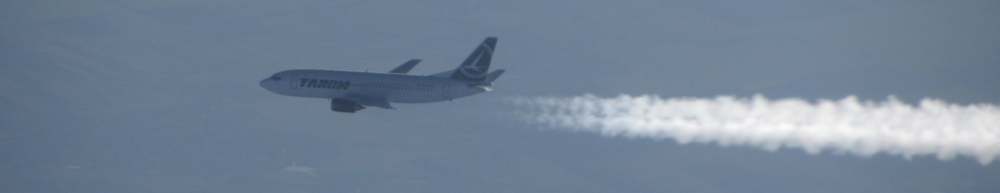

  <h1>Welcome to My Profile</h1>
  

  

<h2>🚀 Welcome Aboard!</h2>

<h2>About Me</h2>

  
📊 My GitHub Stats

   
  

This page is still at `work in progress` stage 🚧

# Hello there 👋
I am an engineer with keen interest in AI and low-level programming as well as drones.

I am currently working on:
RayTracing in C, IRC in C++,  Maths Library for design tools in C++. Furthermore, interested in electronics and microprocessors and researching about them to make a 8bit computer with IC and microprocessors!

📷 [instagram][instagram] **|** 👔 [linkedin][linkedin]

[instagram]: https://www.instagram.com/muktim_coskuner/
[linkedin]: https://www.linkedin.com/in/muktim-coskuner/

